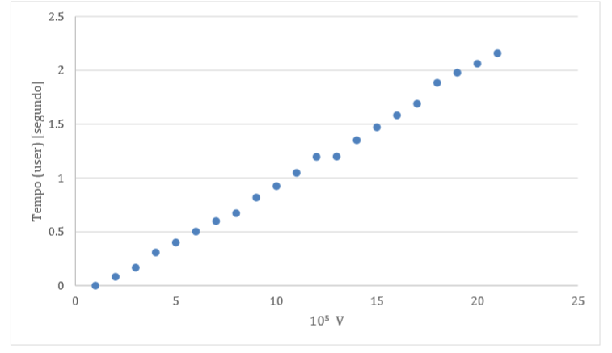

# Relatório 1º projecto ASA 2019/2020

## Descrição do Problema e da Solução

Sabemos de uma estimativa de nota para cada aluno que fez um projecto. Alguns são amigos entre si, a amizade não é sempre recíproca. Se um aluno A é amigo de B, então B partilha a solução do projecto e A fica com a nota de B se B tiver melhor nota do que A.  
Utilizamos um grafo, guardado como uma lista de adjacência. Um aluno é representado por um nó. Se um aluno A é amigo de B, representamo-la como vértice de B para A. 
Mapeamos este problema para o problema de calcular qual é o maior valor que um nó pode propagar num grafo dirigido. 
Para resolver este problema usamos uma solução naïve de fazer BFS a partir de cada nó   
Pequena descrição da solução proposta e mapeamento com o problema (1 ou 2 parágrafos) 

## Análise Teórica 

Fazer BFS com uma ligeira alteração num nó é O(V+E), fazemos DFS em cada nó, i.e. V vezes, por isso a complexidade temporal no pior caso é **O(V(V+E))**, ou seja, é quadrática com o número de nós. 
A ligeira alteração feita ao BFS foi em, ao visitar nós, aumentar a sua nota se o seu predecessor na árvore BF tiver nota maior, obviamente esta operação tem custo constante cada vez que um nó é visitado. 
Apresentamos pseudocódigo de alto nível para esta alteração ao BFS para propagar a nota máxima.

````
for (node in graph):
    queue<nodes> q; 
    q.push(i); 
    while(queue q is not empty):
         node s = q.pop();
          for (node u connected to node i) 
           if (node u is visited) continue;
            if (grade[u] >= grade[i]) continue;
             mark node u as visited;
              grade[u] = max(grade[u], grade[i]);
              q.push(u);

- Ler input tem custo O(V+E)
- Escrever Output tem custo O(V).

### Complexidade global da solução no pior caso: O(V(V+E)). 

## Avaliação Experimental dos Resultados

Foi utilizado gerador.cpp para gerar testes com 3000 sub-redes, V e E em igual número, e V a variar entre 100 000 e 2 000 000 por incrementos de 100 000. Este teste foi corrido 5 vezes, foi registado o tempo usando o comando POSIX time e foi calculada a média aritmética. Em baixo apresenta-se um gráfico com esses dados. 



O autor desta solução previa que este gráfico fosse semelhante a uma parábola. No entanto, com R2 = 0.9977, a aproximação do modelo linear para relacionar o tempo com V é boa. 
Este facto deve-se a o número de nós em cada sub-rede ser limitado.