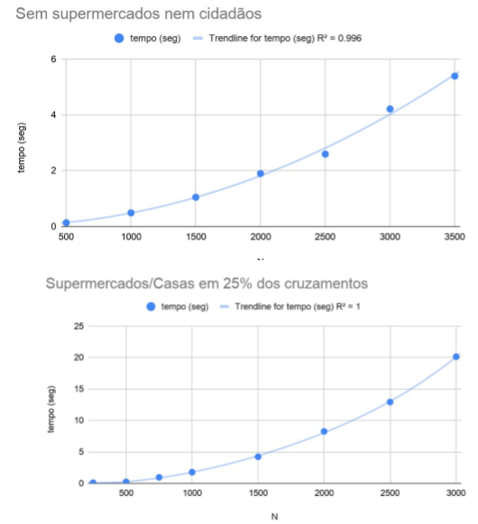

# Relatório 1º projecto ASA 2019/2020

## Descrição do Problema e da Solução

Em Manhattan, por causa do COVID-19, o governador Cuomo decretou medidas de distanciamento social. Para não apanharem o vírus os cidadãos só podem sair de __(porque o professor Caracol mora lá e faz parte de um grupo de risco)__ casa para ir a um qualquer supermercado, não podendo estar mais do que um presente em simultâneo em qualquer cruzamento, rua ou avenida. Pretendemos calcular quantos residentes podem estar na via pública em simultâneo para esse efeito. O mapeamento e solução deste problema com **fluxo máximo** são bastante triviais. Queremos calcular o ​fluxo máximo​ entre várias fontes (supermercados) e vários destinos (casas) com a limitação de não poder haver mais de uma pessoa em cada nó (cruzamento).

Foi criado um novo grafo, a partir do descrito no parágrafo anterior, em que cada nó passa a ser representado por dois nós (V_in que tem dele e V_out que apenas tem arestas que apontam a partir de si, ligados entre si por uma aresta de capacidade um, como está representado no diagrama). Ligamos cada par de nós aos seus vizinhos na grelha de Manhattan, ligamos a fonte ao supermercados e as casas ao destino. Por fim aplicamos o **​algoritmo de Dinic** ​para calcular o fluxo máximo que é apresentado como solução. 

## Análise Teórica 

No enunciado são referidos os seguintes valores como input: 

- N - Número de ruas
- M - Número de avenidas
- S - Número de supermercados
- C - Número de casas

Por ser uma notação mais conveniente definimos |V| e |E| como o número de nós e o número de arestas respectivamente no grafo em que foi aplicado o algoritmo de Dinic. Obviamente, |V| =  2NM, |E| = S + C + |V|

Apresentamos pseudocódigo de muito alto nível. Para evitar redundância, quando está escrito para criar aresta ou ligar aresta, entende-se como criar aresta com capacidade um.

1 -  Lê N, M, S, C - ​O(1) 
1 - Aloca memória para grafo G, dirigido pesado com 2NM+2 nós em lista de adjacência - ​O(V) = O(NM) 
1 - Define uma fonte e um destino - ​O(1) 
1 - Cria aresta entre todos os cruzamentos de  V_in para V_out - ​O(V) = O(NM) 
1 - Liga, todos os nós V_out de  todos os cruzamentos a todos os nós V_in que correspondem a Cruzamentos adjacentes na grelha de Manhattan - ​O(V) = O(NM)
1- Lê input com posições dos supermercados e Liga a fonte a todos os supermercados - ​O(S
1- Lê input com posições das casas e liga-as ao destino - ​O(C) 
1 - Aplica algoritmo de Dinic a G, retorna o output deste Algoritmo. - ​O(V²E) = O(NM² (NM + S + C))

Complexidade global da solução: **​O(NM ²(NM + S + C))**

## Avaliação Experimental dos Resultados 

Foi usado o gerador de instâncias para medir o tempo de execução do programa usando o comando ​time ​ . Com a análise teórica do algoritmo afirmamos que a sua complexidade temporal é O(NM² (NM + S + C)). **​Vamos tentar rejeitar esta hipótese​.**

Usando o gerador de instâncias num caso em que a grelha de Manhattan é quadrada e  não há supermercados nem casas, o resultado deve ser zero e a complexidade deve ser O(N²). ( Ou seja, M = N, S = 0, C = 0. )

Foi realizada uma segunda experiência em que existe 4 cruzamentos para cada supermercado ou casa e existe  um número igual de supermercados e casas. ( Isto é, M = N, S = 0.25*N, C = S. Manteve-se a grelha quadrada )

Nesta segunda experiência, a regressão para um polinómio do quarto grau é ainda melhor.

**Não rejeitamos a hipótese​** de que o algoritmo implementado é ​**O(NM ²(NM + S + C))​**.

## Referências Bibliográficas 
иванов максим. Maximum flow - Dinic's algorithm. Retrieved May 14, 2020 from https://cp-algorithms.com/graph/dinic.html 